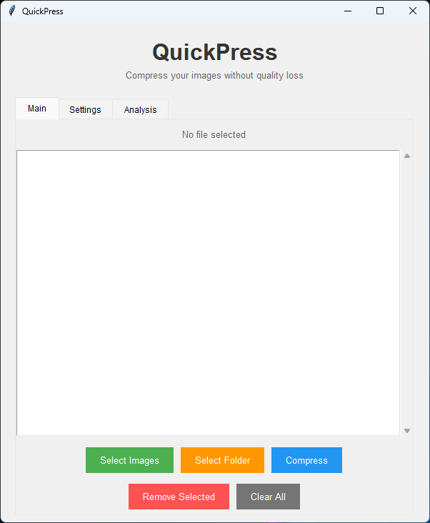
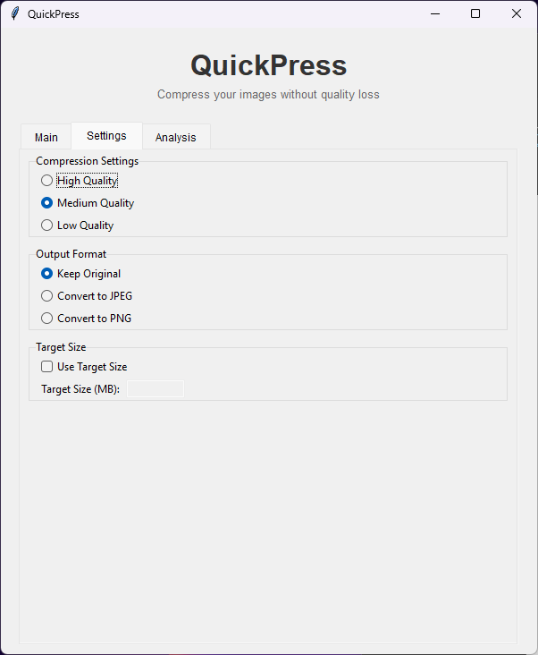
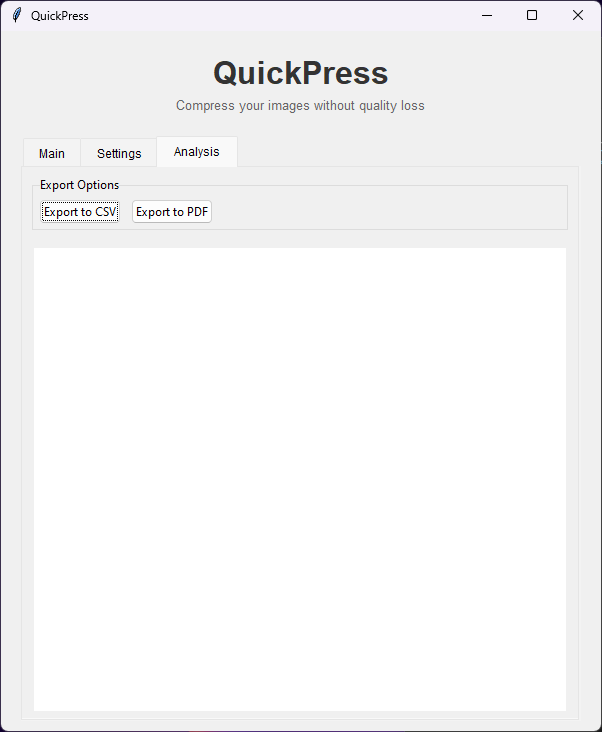
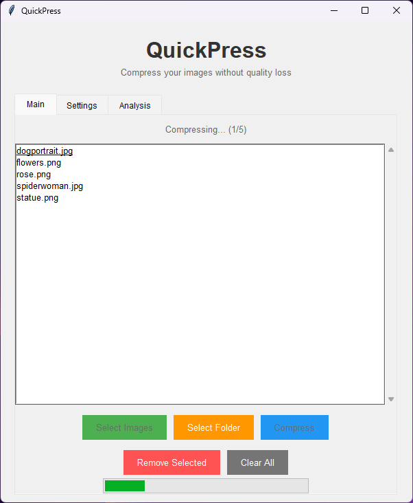

# QuickPress 🚀

A lightweight desktop app that compresses your images without quality loss. Perfect for photographers and web developers who need to reduce file sizes while maintaining image quality.
<p align="center">

</p>

## 📸 Screenshots

<p align="center">
  
  
  
  
</p>

<p align="center">
  
</p>

## ✨ Features
- Simple drag-and-drop interface
- Lossless compression
- No file size limits
- Keeps original files untouched
- Shows compression stats
- Works offline

## ⁉️ How to Use
1. Download and run QuickPress
2. Click "Select Image" to choose your image
3. Hit "Compress Image" and wait a few seconds
4. Find your compressed image in the same folder as the original (with "_compressed" added to the filename)

## 🌎 Download
Grab the latest release from the [releases page](https://github.com/AkinciGorkem/quickpress/releases).

## ⚙️ Building from Source
```
bash
pip install -r requirements.txt
python image-compressor.py
```

## 🤝 Contributing
Contributions are welcome! Please feel free to fork the repository and submit pull requests. You can also open issues to report bugs or suggest new features.
1. **Fork the Repository:** Create your own fork and work on your enhancements or fixes.
2. **Create Pull Requests:** Submit pull requests for your changes to be reviewed and merged into the main project.
3. **Report Issues:** Use the GitHub issues tracker to report bugs or suggest enhancements.

## 📄 License
This project is licensed under the MIT License - see the [LICENSE](LICENSE) file for details.
